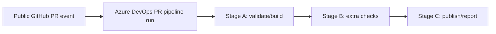
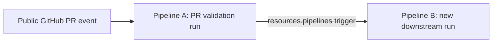

# Azure DevOps PR-Triggered Public Pipelines and Follow-On Execution

## Executive summary

Based on official documentation from entity["company","Microsoft","software company"] and entity["company","GitHub","code hosting company"], the answer is **yes, but with an important split**: in Azure DevOps, a PR-triggered pipeline in a public project can either **run more jobs/stages inside the same pipeline run** if those jobs/stages are already declared in the YAML, or it can **start a separate downstream pipeline run** by using a pipeline completion trigger (`resources.pipelines`). What Azure DevOps **does not** support is dynamically appending a brand-new job/stage to an already-started run from another pipeline or from a completion event. Azure Pipelines processes the run by expanding templates and resolving stage/job execution up front; a downstream completion trigger therefore creates a **new run**, not an extra job inside the existing one. citeturn12view5turn12view4turn11view1turn11view3turn9view0

For the exact scenario in the prompt, the safest high-confidence conclusion is:

* **If your requirement is “same public build / same run”**: use a **multi-job or multi-stage YAML pipeline** and gate the extra work with `dependsOn` and `condition`. This is fully supported, including in PR runs. Azure DevOps explicitly supports conditions on stages/jobs/steps, and `Build.Reason` lets you distinguish PR runs from resource-triggered runs. citeturn11view0turn11view1turn13view1turn15view0
* **If your requirement is “another pipeline after the PR pipeline”**: use a **pipeline completion trigger** with `resources.pipelines`. That is supported natively, including across projects, but it starts a **separate run**. If both pipelines use the same repository, the downstream run uses the same commit; if they use different repositories, Azure DevOps uses the downstream pipeline’s `Default branch for manual and scheduled builds` behavior. citeturn9view0turn8view3turn10view4
* **If your requirement is “dynamically add more work to the already-running build after it started”**: Azure DevOps does **not** expose a native mechanism equivalent to “inject a new job into this existing run after the fact.” The practical alternatives are a same-run multi-stage design, a downstream pipeline, or an external bridge such as the REST API, service hooks/webhooks, or a GitHub Actions bridge. citeturn12view4turn12view5turn18view0turn17view0turn19view1turn21view0turn22view3

Public-project constraints matter. In a public project, Azure DevOps automatically restricts the pipeline job token to **project scope**, and public project contents become publicly accessible; you cannot selectively keep build artifacts private within that public project. In addition, for GitHub PRs from forks, Azure Pipelines withholds secrets and service connection credentials by default, and newer organization/project-level settings can disable or comment-gate fork PR builds entirely. Those constraints do **not** prevent same-run jobs/stages, but they do narrow what is practical for cross-project chaining and for secret-dependent workarounds from untrusted PR code. citeturn7view5turn28view0turn13view4turn13view5

## What Azure DevOps can and cannot do natively

Azure DevOps treats a pipeline **run** as one execution of a pipeline. Within that run, agents execute one or more jobs, steps, and tasks. This matters because the platform boundary for “same build” is the run itself. If you want more work in the same build, it has to be modeled as jobs/stages inside that run. citeturn7view4turn12view5

Azure DevOps natively supports additional stages and jobs in the same run. A stage is a logical boundary that contains jobs; jobs are the smallest unit of work that can be scheduled to run. By default, stages run sequentially, and stages/jobs can be controlled with dependencies and conditions. This is the built-in mechanism closest to “start another job when the PR pipeline runs.” citeturn11view1turn11view3turn11view0

Azure DevOps also natively supports starting **another pipeline** when a pipeline completes. The documented mechanism is a pipeline resource trigger with `resources.pipelines[].trigger`. This is not a continuation of the original build object; it is a new pipeline run. Azure DevOps even distinguishes trigger reasons such as `PullRequest`, `BuildCompletion`, and `ResourceTrigger`. citeturn9view0turn10view4turn15view0

What Azure DevOps does **not** document or support as a first-class capability is a way to “inject” a new job into a run after the run has already been processed. The run-processing documentation is the strongest evidence here: Azure Pipelines first expands templates and evaluates template expressions, then chooses stages, then gathers and validates job resources for authorization, then evaluates jobs, then expands matrix/parallel strategies into runtime jobs. That processing model is why same-run follow-on work must be declared in YAML beforehand, even if conditions later decide whether it actually runs. citeturn12view4turn12view5turn11view2



The diagram above is the supported “same build” model: one run, multiple predeclared stages/jobs, with conditions controlling what executes. citeturn11view1turn11view0turn12view4

## How pipeline completion triggers behave in this scenario

For downstream chaining, Azure DevOps documents pipeline completion triggers through `resources.pipelines`. The source pipeline is named with `source`, an optional `project` can be specified for cross-project use, and `trigger: true` means “run the current pipeline whenever the source pipeline successfully completes.” citeturn9view0turn10view4

If the upstream and downstream pipelines use the **same repository**, Azure DevOps states that both pipelines run using the **same commit** when one triggers the other. That is the most favorable case for PR-driven validation flows where you want downstream testing or packaging to align to the exact PR build content. If the pipelines use **different repositories**, the downstream pipeline instead uses the version from its configured `Default branch for manual and scheduled builds`. citeturn9view0turn8view3turn10view4

Azure DevOps supports filtering pipeline completion triggers by **branches**, **tags**, and even **stages** of the upstream pipeline. Stage filters are particularly useful if you only want the downstream pipeline to start after a specific stage in the upstream PR pipeline completes. citeturn8view3turn9view2turn10view4

There are several documented caveats that are especially relevant for PR-triggered pipelines:

* Pipeline completion triggers are **not supported in YAML templates**. You can define pipeline resources in templates, but the completion-trigger configuration itself must live in the top-level pipeline YAML. citeturn9view0
* Branch evaluation is subtle. Azure DevOps’ general trigger rules say that **PR triggers use the YAML in the source branch of the pull request**, while **pipeline completion triggers** follow the special completion-trigger branch rules and rely on the downstream pipeline’s `Default branch for manual and scheduled builds` for matching trigger filters. That means a downstream trigger that works for `main` can still fail for PR feature branches if the downstream default-branch YAML does not contain matching branch filters. citeturn33view0turn9view2
* If branch filters seem broken, Microsoft explicitly recommends trying the `refs/heads/` prefix. Cross-project completion triggers can also fail if the downstream default branch is stored as `main` instead of `refs/heads/main`. citeturn8view3turn8view4turn9view0



This is the supported “new run after PR pipeline” model. It is native Azure DevOps behavior, but it is **not** the same build/run. citeturn9view0turn10view4

## PR context, public-project permissions, and GitHub connections

For GitHub repositories, Azure Pipelines can automatically validate pull requests and commits. If no `pr` block is present in the YAML, PR validation is effectively enabled for all branches by default. Azure DevOps also documents draft PR behavior and shows that PR-only logic can be added with `Build.Reason == PullRequest`. citeturn7view8turn13view0turn13view1

The GitHub integration layer is separate from pipeline-to-pipeline triggers. For the original PR pipeline to exist, Azure DevOps needs GitHub access. Microsoft recommends the **Azure Pipelines GitHub App** for CI pipelines. With the GitHub App, builds and status updates use the Azure Pipelines identity rather than a personal GitHub identity, and the app requests permissions such as code write, metadata read, checks read/write, and pull requests read/write. If you use OAuth or PAT authentication instead, builds and status updates run on behalf of the user identity that created the connection. citeturn29view0turn29view1turn29view2turn29view3

For PAT-based GitHub service connections, Azure DevOps shows the recommended GitHub scopes as `repo`, `user`, and `admin:repo_hook`. Azure DevOps also recommends **not** granting service connections to all pipelines by default, but authorizing each pipeline individually. This matters for downstream pipelines because the pipeline completion trigger itself does not need a GitHub service connection, but any downstream job that checks out repositories or uses protected resources will still need these authorizations. citeturn31view0turn7view2turn7view3turn7view7

Public projects introduce a second layer of restrictions. When project visibility is public, Azure DevOps makes project contents publicly accessible and forces build pipeline scope down to **project scope**. The job access token used by pipelines in public projects is therefore automatically project-scoped, regardless of broader organization settings. Microsoft explicitly states that jobs in a public project can access resources only within that project, not in other projects of the same organization. This is the strongest official reason to prefer same-project downstream pipelines in your scenario and to treat cross-project automation from the PR build’s own token as unsupported by default. citeturn7view5turn28view0turn7view1

Forked PRs are the biggest trust boundary. For GitHub pipelines, Azure DevOps does **not** make secrets available to fork PR validations by default. The withheld items include the repository security token, service connection credentials, secure files, and secret variables. Azure DevOps also added organization/project-level controls for how fork PRs are built, including disabling them, securely building them, or requiring a team-member comment before building. In newer organizations, secure handling of fork PRs is on by default. If your public repository accepts outside contributions, these settings can be the difference between “yes, this workaround works” and “no, this run never got the credentials needed to trigger anything.” citeturn13view4turn13view5turn1search7turn1search3

One more cross-repository limitation is easy to miss: Microsoft documents that when the Azure Pipelines GitHub App is used for the same GitHub repository in **multiple Azure DevOps organizations**, only the **first** organization’s pipelines can be automatically triggered by GitHub commits or PRs. Secondary organizations can still run manually or on schedule. That restriction is about cross-organization use, not cross-project use within the same organization, but it is relevant if your “public repo” is wired into more than one Azure DevOps organization. citeturn29view0

## YAML and API examples

The most direct way to get “another job on the same build” is to author the job or stage directly into the PR pipeline and gate it with a condition. Azure DevOps explicitly supports using conditions on stages/jobs/steps, and the documented `Build.Reason` values include `PullRequest`, `BuildCompletion`, and `ResourceTrigger`. citeturn11view0turn15view0

```yaml
# azure-pipelines.yml
pr:
  branches:
    include:
      - '*'

trigger: none

stages:
- stage: Validate
  jobs:
  - job: BuildAndTest
    pool:
      vmImage: ubuntu-latest
    steps:
    - script: echo "Compile and test PR"

- stage: ExtraPrChecks
  dependsOn: Validate
  condition: and(succeeded(), eq(variables['Build.Reason'], 'PullRequest'))
  jobs:
  - job: SecurityScan
    pool:
      vmImage: ubuntu-latest
    steps:
    - script: echo "Run additional PR-only checks"
```

This is the supported same-run pattern. The extra stage is part of the original PR run; it is not dynamically injected later. citeturn11view0turn11view1turn12view4turn15view0

For a **separate downstream pipeline**, use `resources.pipelines`. The trigger itself is Azure DevOps-to-Azure DevOps; it does not require a GitHub service connection. If downstream jobs use protected resources such as service connections, repositories, environments, or secure files, those still need authorization. Pipeline resources themselves are classified by Microsoft as **open resources**. citeturn9view0turn10view4turn7view7turn19view1

```yaml
# downstream-pipeline.yml
trigger: none
pr: none

resources:
  pipelines:
  - pipeline: upstreamPr
    source: PublicRepo-PR-CI
    # project: SameOrgOtherProject   # required only if the source pipeline is in another project
    trigger: true

stages:
- stage: Consume
  jobs:
  - job: DownloadAndUseArtifacts
    pool:
      vmImage: ubuntu-latest
    steps:
    - download: upstreamPr
    - script: |
        echo "Triggered by pipeline resource"
        echo "Trigger reason: $(Build.Reason)"
```

In this model, `Build.Reason` on the downstream run is expected to be a resource/build-trigger value, and Microsoft recommends using resource variables rather than the old `Build.TriggeredBy.*` variables for YAML pipeline-resource scenarios. citeturn15view0turn10view4turn19view1

If you want to trigger only after a specific upstream stage completes, use a stage filter. This is often a better fit than full-pipeline completion when the upstream PR pipeline has a distinct validation stage. citeturn9view2turn10view4

```yaml
trigger: none
pr: none

resources:
  pipelines:
  - pipeline: upstreamPr
    source: PublicRepo-PR-CI
    trigger:
      stages:
        - Validate

jobs:
- job: RunAfterValidate
  steps:
  - script: echo "Started after upstream Validate stage completed"
```

If native triggers are too rigid, the REST API is the main fallback. Azure DevOps documents `POST .../_apis/pipelines/{pipelineId}/runs` to start a pipeline run, and the API requires a token with `vso.build_execute` capability. In a public project, however, the job token is project-scoped, so this pattern is strongest for **same-project** triggering unless you intentionally provide a different credential. Do not do that for untrusted public/fork PR code unless you fully understand the exposure. citeturn18view0turn28view0turn13view4

```yaml
steps:
- bash: |
    curl -sS \
      -H "Authorization: Bearer $(System.AccessToken)" \
      -H "Content-Type: application/json" \
      -X POST \
      "$(System.CollectionUri)$(System.TeamProject)/_apis/pipelines/42/runs?api-version=7.1" \
      -d '{
            "templateParameters": {
              "upstreamRunId": "$(Build.BuildId)"
            },
            "resources": {
              "repositories": {
                "self": {
                  "refName": "$(Build.SourceBranch)"
                }
              }
            }
          }'
  displayName: "Queue downstream pipeline via REST"
```

This example is conceptually valid against the documented Runs API, but in practice it depends on the current run having a token that can queue the target pipeline and on the target being reachable within the public project’s scope restrictions. citeturn18view0turn28view0

For a webhook-based bridge, Azure DevOps documents two complementary primitives: **service hooks** can emit Azure DevOps events such as `build.complete` or pipeline run-state events to a public HTTPS endpoint, and YAML **webhook resources** can start pipelines based on incoming webhook events through an incoming-webhook service connection. The webhook resource is the native answer when you need to trigger a pipeline from an external event that first-class pipeline resources do not cover. Creating service-hook subscriptions requires Project Collection Administrator permission, and webhook targets must be public HTTPS endpoints. citeturn17view0turn17view1turn19view0turn19view1

```yaml
# consumer-pipeline.yml
trigger: none
pr: none

resources:
  webhooks:
  - webhook: UpstreamSignal
    connection: MyIncomingWebhook
    filters:
      - path: eventType
        value: build.complete

jobs:
- job: ReactToWebhook
  steps:
  - script: echo "Received external completion signal"
```

Finally, if you want a GitHub-style “workflow completed, now queue Azure DevOps” pattern, Microsoft ships an official GitHub Action (`Azure/pipelines`) to trigger Azure Pipelines, and GitHub provides the `workflow_run` event to chain workflows on completion. This is often the cleanest bridge when the repo is already on GitHub and you want GitHub to own the event choreography while Azure DevOps owns selected downstream runs. citeturn21view0turn23search0turn22view3

```yaml
name: Queue Azure DevOps after GitHub workflow completion

on:
  workflow_run:
    workflows: ["PR CI"]
    types: [completed]

jobs:
  queue-ado:
    if: ${{ github.event.workflow_run.conclusion == 'success' }}
    runs-on: ubuntu-latest
    steps:
      - uses: Azure/pipelines@v1
        with:
          azure-devops-project-url: https://dev.azure.com/ORG/PROJECT
          azure-pipeline-name: Downstream-Pipeline
          azure-devops-token: ${{ secrets.AZURE_DEVOPS_TOKEN }}
```

GitHub’s own documentation explicitly states that `workflow_run` fires when another workflow is requested or completed, and that the later workflow can access secrets/write tokens even if the earlier workflow was unprivileged. That capability is powerful, but it is also exactly why GitHub warns about security risks when untrusted code is involved. citeturn22view3turn22view2turn21view2

## Comparison of implementation options

| Option | Feasibility | Complexity | Security implications | Example snippet |
|---|---|---|---|---|
| Same YAML stages/jobs citeturn11view1turn11view0turn12view4 | **High** for “same build / same run” | Low | Best native fit. No extra trust boundary, but any logs/artifacts in a public project remain public. citeturn7view5turn28view0 | `condition: eq(variables['Build.Reason'], 'PullRequest')` |
| Native downstream pipeline via `resources.pipelines` citeturn9view0turn10view4 | **High** for “new run after PR pipeline,” **not** for “same build” | Medium | Pipeline resources are open resources, but downstream protected resources still need authorization; cross-project behavior is constrained by public-project token scope. citeturn7view7turn28view0turn7view1 | `resources.pipelines[].trigger: true` |
| REST API / service hook / webhook bridge citeturn18view0turn17view0turn17view1turn19view1 | **Medium to High** when native trigger semantics are insufficient | Medium to High | Requires a queue-capable token or endpoint. In public/fork PRs, secrets are commonly unavailable by default, so design carefully. citeturn13view4turn13view5 | `POST .../_apis/pipelines/{id}/runs` |
| GitHub Actions bridge citeturn22view3turn21view0turn23search0 | **High** if using GitHub Actions is acceptable | Medium | Secrets move to GitHub. `workflow_run` can access secrets/write tokens in the follow-on workflow, which is useful but security-sensitive. citeturn22view2turn21view2 | `on: workflow_run` + `uses: Azure/pipelines@v1` |

The decision rule is simple: if the user story literally says **“in the same build”**, prefer the first row. If it says **“after this pipeline finishes, run another pipeline”**, prefer the second row. Use the last two rows only when native completion triggers are blocked by trust boundaries, cross-project/public-project constraints, or the need to integrate with non-Azure-DevOps events. citeturn12view5turn9view0turn17view0turn22view3

## Limitations, workarounds, and final conclusion

Several limitations are explicit in Microsoft’s documentation. Pipeline completion triggers are unavailable in YAML templates. UI trigger settings can override YAML trigger definitions. Branch behavior differs by trigger type: PR triggers use the source-branch YAML for the pull request, while pipeline-completion triggers have their own default-branch evaluation rules. In practice, if a downstream trigger seems not to fire for feature branches or PR validations, the first places to inspect are the downstream pipeline’s `Default branch for manual and scheduled builds`, any branch filters, and whether the UI is overriding the YAML. citeturn9view0turn9view2turn33view0

Public-project restrictions are the other hard limit. Because public-project job tokens are automatically project-scoped, **same-project** chaining is the native sweet spot. A PR build in a public project should not be assumed able to reach into other projects through its own job token. If you truly need cross-project or cross-system follow-on behavior, use an intentionally provisioned credential outside the untrusted PR execution path, or move the orchestration to a safer external system such as GitHub Actions or a webhook receiver. citeturn28view0turn17view1turn22view3

The community sources are consistent with the official docs on the major pain points. GitHub issue reports show confusion around `pipeline` alias vs `source` pipeline name, inconsistent behavior when relying on implicit “all branches” pipeline-resource triggers, and operational trigger failures that disappear once branch filters are made explicit. A Microsoft Q&A thread also describes cases where GitHub `opened` PR events stopped queuing builds until the service connection/webhook was re-verified, or where UI overrides and target-branch YAML mismatches caused Azure DevOps to receive the event but find no matching pipeline. These sources are not product contracts, but they are useful edge-case warnings. citeturn26view1turn26view0turn26view2

The bottom line is:

* **Yes**, Azure DevOps can run additional work when a public GitHub-PR-triggered Azure DevOps pipeline runs. citeturn7view8turn11view0turn9view0
* **Yes**, it can be **inside the same run**, but only if those jobs/stages are already declared in the pipeline YAML and gated with conditions/dependencies. citeturn11view1turn11view0turn12view4
* **Yes**, it can be **another pipeline**, natively, via `resources.pipelines`, including across projects, but that is a **new pipeline run**, not “another job in the same public build.” citeturn9view0turn10view4turn8view3
* **No**, Azure DevOps does not provide a native way to dynamically append new jobs/stages to an already-started PR build the way one might colloquially imagine a workflow-completion system working. The closest analogs are same-run staged design, pipeline-completion-triggered downstream runs, or external orchestration through REST/webhooks/GitHub Actions. citeturn12view4turn12view5turn18view0turn19view1turn22view3

## Open questions and scenario limits

Two points remain scenario-dependent rather than universally guaranteed.

First, the official docs make the **project-scoped** nature of public-project job tokens explicit, but they do not spell out every same-project REST-queue permutation for PR validations in public projects. The report therefore treats same-project REST queuing as plausible and commonly workable, while treating cross-project use of the PR build’s own token as explicitly constrained. citeturn28view0turn18view0

Second, the exact behavior for PRs from forks depends on your organization/project fork-build policy and whether the incoming PR is from the same repository or an external fork. Because the prompt does not specify those settings, this report assumes only what the docs guarantee: secrets are withheld by default for fork PRs, and newer controls may disable or comment-gate such builds. citeturn13view4turn13view5